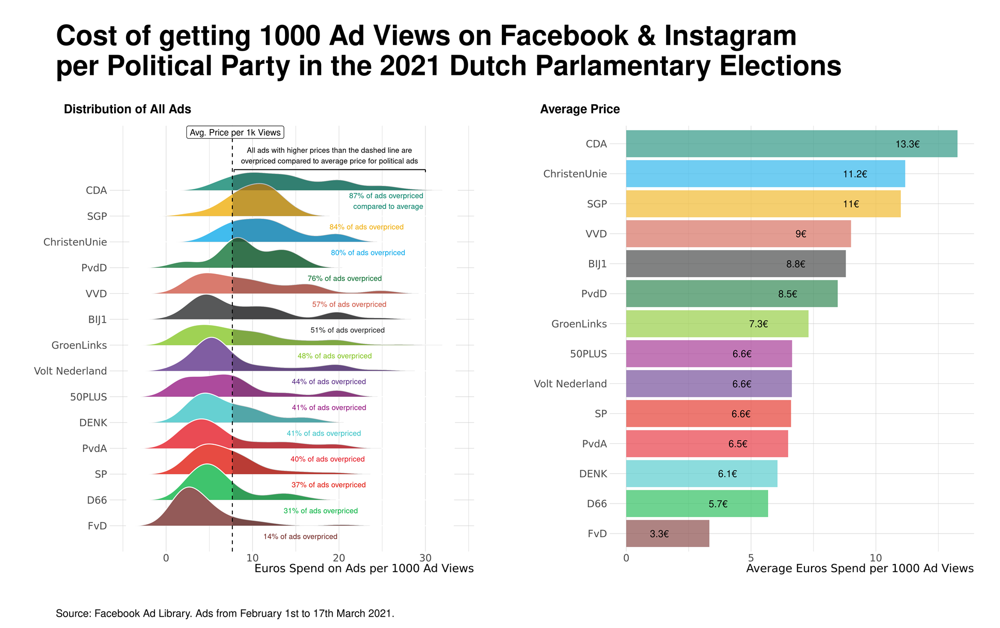

+++
date = 2023-07-06
lastmod = 2023-07-06
draft = false
tags = ["microtargeting", "political-advertising", "facebook", "meta"]
title = "Political Microtargeting and Ad Delivery Algorithms"
math = true
summary = """
How the ad delivery algorithm in political microtargeting affects campaigns and voters.
"""

[header]
image = "headers/Picture2.png"
caption = "Microtargeting in Political Campaigns: Boon or Bane?"

+++

So far, online political microtargeting has been mainly understood as a strategic choice that advertisers can make to maximize the impact of their messaging by reaching certain audiences that are most most likely to be receptive of them. 

In fact, social media companies like Meta have built an entire business model around this promise. In a public outreach campaign Meta started in early 2021 called "[Good Ideas Deserve To Be Found](https://about.meta.com/supportsmallbusiness/personalized-ads/)" they stress the importance of allowing targeted personalized ads because it helps thousands of businesses find their niche audience.

This idea can also be found in a lot of the reporting on microtargeting, that centers companies like Cambridge Analytica or other bad actors who are allegedly capable of launching highly personalized and thus effective ad campaigns to manipulate voters.

The implicit assumption of these narratives is that advertisers have strong control over who sees their ads and that they can in fact reach who they are attempting to target. Unfortunately, little public scrutiny and academic attention has been given to the entity that is ultimately responsible for why an ad shows up in a personalized newsfeed: *the ad delivery algorithm*.
The Facebook ad delivery algorithm is set up to learn over time what kind of individuals are more likely to fulfill the ad goal, be it clicking the ad or buying a product, and shows ads to users based on an inferred relevance score.

**What does the research say?**

Some research indeed finds that the Meta's ad delivery algorithm is steering ads towards certain audiences without the explicit intention or knowledge of the advertiser themselves. [Ali et al. 2019](https://dl.acm.org/doi/10.1145/3359301) find that ads that ran at the same time, with the custom same audience, and the same budget can be heavily skewed along gendered and racial stereotypes.

In the realm of political advertising, researchers have also found that ads are more likely to be delivered to ideologically congruent audiences. Moreover [Ali et al. 2021](https://dl.acm.org/doi/10.1145/3437963.3441801) find evidence for an increased cost for reaching ideologically incongruent audiences: for example, when placing a liberal ad to a liberal audience they had to pay 21 Dollar per 1000 reached users, whereas a conservative ad delivered to a liberal audience cost almost twice as much with 40 Dollar per 1000 users. 

[Another report by The Markup](https://themarkup.org/election-2020/2020/10/29/facebook-political-ad-targeting-algorithm-prices-trump-biden) reveals that ads targeted at older voters during the US 2020 election were six times more expensive for the Biden campaign compared to the Trump campaign.

Much of the research concerning ad algorithms has been focused on the United States. There's a scarcity of data when it comes to the European multi-party context. Our current investigation involves the Dutch 2021 parliamentary election as a case study to understand whether ad delivery skews also occur in Europe.

Preliminary findings show that during this election, Meta charged different prices for reaching 1000 ad views, with discrepancies among political parties. For instance, the CDA paid more than twice as much as the PvdA to reach the same number of views. However, looking at the ad library data alone is not enough to infer that Facebook inherently (dis-) advantages one party over the other. For example, one party may just be more skilled at using the Facebook Ad Manager and thus extract a more cost-efficient result. In order to establish whether biases in ad delivery are taking place we need a compare the same ads with the same targeting criteria across parties.
