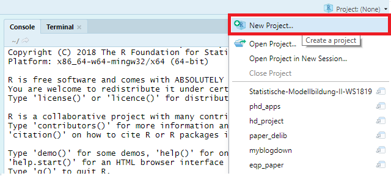
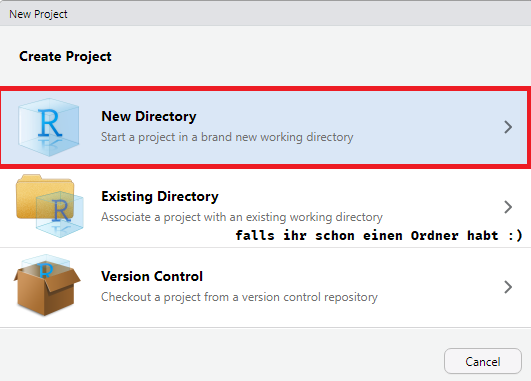
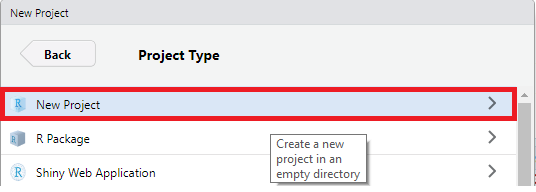
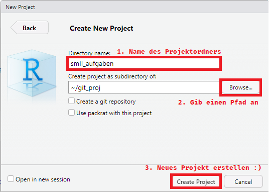
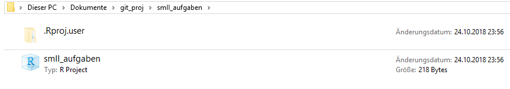
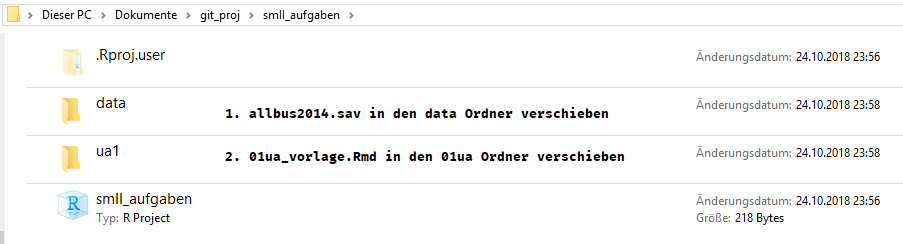
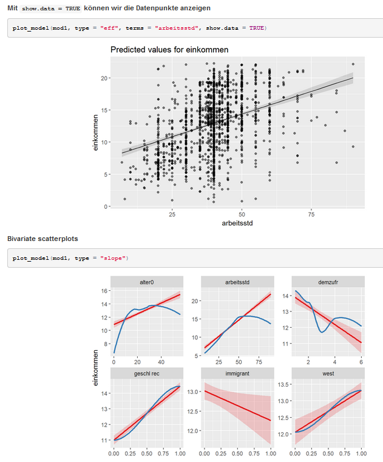

```{r, include = F}
pacman::p_load(tidyverse, knitr, haven, texreg, sjPlot, sjmisc)
```


## Übersicht

1. Übungsaufgabe - SPSS
  + Wichtige Befehle
2. Übungsaufgabe - R
  + Projekte & Datenpfade
  + Hilfreiche Funktionen

---

class: center, middle

## Ziel der Übungsaufgabe

### (Multivariate) Lineare Regression kennenlernen

---

class: center, middle

## Übungsaufgabe SPSS

[In SPSS]

---

class: center, middle

## Übungsaufgabe R

---

## Projekte & Datenpfade

> Mit Hilfe von **Projekten** können wir Ordnung halten!


1: Neues Projekt öffnen

<center>

</center>

---

## Projekte & Datenpfade

> Mit Hilfe von **Projekten** können wir Ordnung halten!


2: Auf `New Directory` klicken

<center>

</center>

---

## Projekte & Datenpfade

> Mit Hilfe von **Projekten** können wir Ordnung halten!


3: Auf `New Project` klicken

<br>

<center>

</center>

---

## Projekte & Datenpfade

> Mit Hilfe von **Projekten** können wir Ordnung halten!


4: Details eures Projektes ausfüllen


<center>

</center>


---


## Projekte & Datenpfade

> Mit Hilfe von **Projekten** können wir Ordnung halten!


5: So oder so ähnlich sollte euer Ordner jetzt aussehen

<br>

<center>

</center>

---

## Projekte & Datenpfade

> Mit Hilfe von **Projekten** können wir Ordnung halten!


6: Ordnerstruktur erstellen

<center>

</center>

---


## Projekte & Datenpfade


+ In einem R Projekt ist das `Working Directory` immer dorthin gelegt wo das Projekt liegt
    + Noch genauer: Immer wo das jeweilige Skript (`.Rmd` oder `.R` file) innerhalb des Projekts liegt 

--

+ So erspart man sich lange hässliche Pfade zu kopieren :)

```{r,, eval = F}
getwd()
```


```{r, echo = F}
"C:/Users/Fabio/Documents/git_proj/smII_aufgaben/01ua"
```


+ In unserem Fall wollen wir noch den folgenden Part zu unserem Pfad hinzufügen:

--

```{r, echo = F}
"../"
```

+ Dadurch springt der Pfad einen Ordner nach oben, wo sich der `data` Ordner befindet :)


---

## Projekte & Datenpfade


**Der riesige Vorteil: kein Datenwirrwarr und alle Pfade sind gelegt!**

```{r}
allbus <- read_sav("../data/allbus2014.sav")

allbus %>% select(V1:V15) %>% head() %>% kable(., "html")
```

---

class: center, middle

### Jetzt noch ein paar hilfreiche Funktionen für die Übungsaufgabe


---

#### Hilfreiche Funktionen für Übungsaufgabe

> Datensatz einladen

```{r, eval = F}
allbus <- read_sav("../data/allbus2014.sav") 
```

> Datensatz inspizieren mit `binoculaR`

```{r, eval = F}
# devtools muss dazu einmal installiert werden

install.packages("devtools")

# jetzt kann binoculaR über GitHub installiert werden

devtools::install_github("systats/binoculaR") 
```

Anwendung von [binoculaR](https://github.com/systats/binoculaR#binocular)

```{r, eval = F}
binoculaR(allbus) 
```


---

#### Hilfreiche Funktionen für Übungsaufgabe

> Variablen auswählen

```{r, eval = F}
select(data, var1, var2, var3)
```


> Variablen umbennen

```{r, eval = F}
rename(data, var1_new = var1, 
             var2_new = var2, 
             var3_new = var3)
```

> Neue Variable erstellen und Rekodieren

```{r, eval = F}
mutate(data, var1_new2 = var1_new + 5, 
             var2_new2 = ifelse(var2_new == 1, NA, var2_new), 
             var3_new2 = ifelse(var3_new == 1 | var3_new == 2, 1, var3_new))
```


---

#### Hilfreiche Funktionen für Übungsaufgabe

> Neue Variable erstellen und Rekodieren

```{r, eval = F}
mutate(data, var1_new2 = var1_new + 5, 
             var2_new2 = ifelse(var2_new == 1, NA, var2_new), 
             var3_new2 = ifelse(var3_new == 1 | var3_new == 2, 1, var3_new))
```

> Remember:

`ifelse` funktioniert nach folgender Logik:

1. Argument: `logischer Test` 
2. Argument: was soll passieren wenn `TRUE` 
3. Argument: was soll passieren wenn `FALSE`

Falls ihr nochmal Anwendungsbeispiele braucht, schaut doch in das `01_intro.Rmd` aus der ersten Sitzung :)


---

#### Hilfreiche Funktionen für Übungsaufgabe

> Variablen inspizieren

```{r}
frq(allbus, V58)
```

---

> Lineare Regression

```{r, echo=F}
y <- 1:100
x1 <- y * runif(100)
x2 <- x1*y + runif(100)
x3 <- x2 * y * runif(100)
x4 <- x1*x3*y + runif(100)

example_data <- tibble(y, x1, x2, x3, x4)
```


```{r, results="hide"}
model1 <- lm(y ~ x1 + x2, data = example_data)

htmlreg(model1) 
```

.pull-left[

<head>
<title>Statistical models</title>
</head>

<table cellspacing="0" align="center" style="border: none;">
<caption align="bottom" style="margin-top:0.3em;">Statistical models</caption>
<tr>
<th style="text-align: left; border-top: 2px solid black; border-bottom: 1px solid black; padding-right: 12px;"><b></b></th>
<th style="text-align: left; border-top: 2px solid black; border-bottom: 1px solid black; padding-right: 12px;"><b>Model 1</b></th>
</tr>
<tr>
<td style="padding-right: 12px; border: none;">(Intercept)</td>
<td style="padding-right: 12px; border: none;">38.15<sup style="vertical-align: 0px;">***</sup></td>
</tr>
<tr>
<td style="padding-right: 12px; border: none;"></td>
<td style="padding-right: 12px; border: none;">(3.35)</td>
</tr>
<tr>
<td style="padding-right: 12px; border: none;">x1</td>
<td style="padding-right: 12px; border: none;">-0.68</td>
</tr>
<tr>
<td style="padding-right: 12px; border: none;"></td>
<td style="padding-right: 12px; border: none;">(0.35)</td>
</tr>
<tr>
<td style="padding-right: 12px; border: none;">x2</td>
<td style="padding-right: 12px; border: none;">0.02<sup style="vertical-align: 0px;">***</sup></td>
</tr>
<tr>
<td style="padding-right: 12px; border: none;"></td>
<td style="padding-right: 12px; border: none;">(0.00)</td>
</tr>
<tr>
<td style="border-top: 1px solid black;">R<sup style="vertical-align: 0px;">2</sup></td>
<td style="border-top: 1px solid black;">0.55</td>
</tr>
<tr>
<td style="padding-right: 12px; border: none;">Adj. R<sup style="vertical-align: 0px;">2</sup></td>
<td style="padding-right: 12px; border: none;">0.54</td>
</tr>
<tr>
<td style="padding-right: 12px; border: none;">Num. obs.</td>
<td style="padding-right: 12px; border: none;">100</td>
</tr>
<tr>
<td style="border-bottom: 2px solid black;">RMSE</td>
<td style="border-bottom: 2px solid black;">19.67</td>
</tr>
<tr>
<td style="padding-right: 12px; border: none;" colspan="3"><span style="font-size:0.8em"><sup style="vertical-align: 0px;">***</sup>p &lt; 0.001, <sup style="vertical-align: 0px;">**</sup>p &lt; 0.01, <sup style="vertical-align: 0px;">*</sup>p &lt; 0.05</span></td>
</tr>
</table>

]

.pull-right[

Eine Regression spezifieren wir in `R` mit der `lm()` Funktion

Syntax:

1. Die AV, hier `y`
2. `~` = "wird erklärt durch"
3. Die UVs `x1 + x2`
4. Zu guter letzt: der Datensatz: `data = example_data`

Letztlich können wir uns das Modell anzeigen lassen:

+ `screenreg` in Rstudio
+ `htmlreg` für Webseiten 
+ `texreg` für PDF Reports

]

---

> Lineare Regression II

Mit `list()` können wir auch mehrere Modelle nebeinander darstellen

```{r, results="hide"}
model2 <- lm(y ~ x1 + x2 + x3, data = example_data)
model3 <- lm(y ~ x1 + x2 + x3 + x4, data = example_data)

htmlreg(list(model1, model2, model3), single.row = T) 
```

<table cellspacing="0" align="center" style="border: none;">
<caption align="bottom" style="margin-top:0.3em;"></caption>
<tr>
<th style="text-align: left; border-top: 2px solid black; border-bottom: 1px solid black; padding-right: 12px;"><b></b></th>
<th style="text-align: left; border-top: 2px solid black; border-bottom: 1px solid black; padding-right: 12px;"><b>Model 1</b></th>
<th style="text-align: left; border-top: 2px solid black; border-bottom: 1px solid black; padding-right: 12px;"><b>Model 2</b></th>
<th style="text-align: left; border-top: 2px solid black; border-bottom: 1px solid black; padding-right: 12px;"><b>Model 3</b></th>
</tr>
<tr>
<td style="padding-right: 12px; border: none;">(Intercept)</td>
<td style="padding-right: 12px; border: none;">40.90 (3.63)<sup style="vertical-align: 0px;">***</sup></td>
<td style="padding-right: 12px; border: none;">41.22 (3.60)<sup style="vertical-align: 0px;">***</sup></td>
<td style="padding-right: 12px; border: none;">39.11 (3.28)<sup style="vertical-align: 0px;">***</sup></td>
</tr>
<tr>
<td style="padding-right: 12px; border: none;">x1</td>
<td style="padding-right: 12px; border: none;">-0.92 (0.33)<sup style="vertical-align: 0px;">**</sup></td>
<td style="padding-right: 12px; border: none;">-1.10 (0.35)<sup style="vertical-align: 0px;">**</sup></td>
<td style="padding-right: 12px; border: none;">-1.43 (0.32)<sup style="vertical-align: 0px;">***</sup></td>
</tr>
<tr>
<td style="padding-right: 12px; border: none;">x2</td>
<td style="padding-right: 12px; border: none;">0.02 (0.00)<sup style="vertical-align: 0px;">***</sup></td>
<td style="padding-right: 12px; border: none;">0.02 (0.00)<sup style="vertical-align: 0px;">***</sup></td>
<td style="padding-right: 12px; border: none;">0.03 (0.00)<sup style="vertical-align: 0px;">***</sup></td>
</tr>
<tr>
<td style="padding-right: 12px; border: none;">x3</td>
<td style="padding-right: 12px; border: none;"></td>
<td style="padding-right: 12px; border: none;">-0.00 (0.00)</td>
<td style="padding-right: 12px; border: none;">0.00 (0.00)<sup style="vertical-align: 0px;">***</sup></td>
</tr>
<tr>
<td style="padding-right: 12px; border: none;">x4</td>
<td style="padding-right: 12px; border: none;"></td>
<td style="padding-right: 12px; border: none;"></td>
<td style="padding-right: 12px; border: none;">-0.00 (0.00)<sup style="vertical-align: 0px;">***</sup></td>
</tr>
<tr>
<td style="border-top: 1px solid black;">R<sup style="vertical-align: 0px;">2</sup></td>
<td style="border-top: 1px solid black;">0.52</td>
<td style="border-top: 1px solid black;">0.53</td>
<td style="border-top: 1px solid black;">0.62</td>
</tr>
<tr>
<td style="padding-right: 12px; border: none;">Adj. R<sup style="vertical-align: 0px;">2</sup></td>
<td style="padding-right: 12px; border: none;">0.51</td>
<td style="padding-right: 12px; border: none;">0.52</td>
<td style="padding-right: 12px; border: none;">0.61</td>
</tr>
<tr>
<td style="padding-right: 12px; border: none;">Num. obs.</td>
<td style="padding-right: 12px; border: none;">100</td>
<td style="padding-right: 12px; border: none;">100</td>
<td style="padding-right: 12px; border: none;">100</td>
</tr>
<tr>
<td style="border-bottom: 2px solid black;">RMSE</td>
<td style="border-bottom: 2px solid black;">20.33</td>
<td style="border-bottom: 2px solid black;">20.14</td>
<td style="border-bottom: 2px solid black;">18.21</td>
</tr>
<tr>
<td style="padding-right: 12px; border: none;" colspan="5"><span style="font-size:0.8em"><sup style="vertical-align: 0px;">***</sup>p &lt; 0.001, <sup style="vertical-align: 0px;">**</sup>p &lt; 0.01, <sup style="vertical-align: 0px;">*</sup>p &lt; 0.05</span></td>
</tr>
</table>

---

> Lineare Regression III

```{r, fig.width=6}
plot_model(model3, show.p = T, show.values = T)
```

---

> Lineare Regression IV

Mehr Anwendungsfälle für [plot_model](https://cronbach.github.io/plot_model/)



---

class: center, middle

### Jetzt können wir loslegen :)


