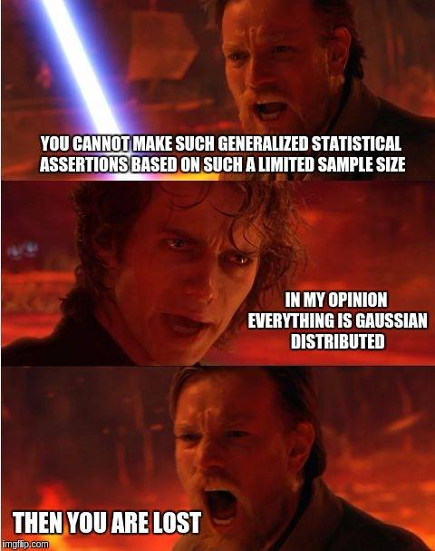
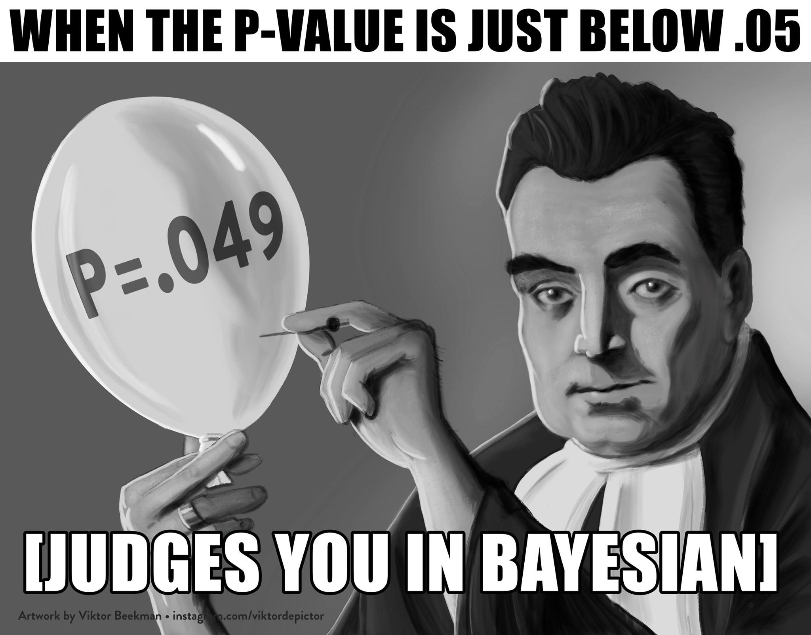

class: inverse, center, middle

<!-- <br> -->
<!-- <br> -->
<!-- <br> -->
<!-- <br> -->

<!--  -->


## Story Time


---

## Overview

+ Theory
+ Gezellig et al. 2019
+ Flat Prior Model
  + Model Diagnostics
  + Model Results
+ Informative Prior Model
  + Model Diagnostics
  + Model Results

---

```{r setup, include=FALSE}
options(htmltools.dir.version = FALSE)

pacman::p_load(tidyverse, tidytemplate, ggmcmc, ggthemes, gridExtra, rjags, sjPlot, magrittr, tidybayes, ggridges)

knitr::opts_chunk$set(fig.width = 8, warning = F, message = F, echo = F)

source("scripts/helpers.R")
```

```{r, echo = F}
glm_mod <- load_it("data/glm_mod.Rdata")


flat_results <- load_it("data/flat_results.Rdata")
info_results <- load_it("data/info_results.Rdata")

tidy_flat_results <- ggs(flat_results) 
tidy_info_results <- ggs(info_results) 
```

## Theory

.pull-left[

] 


.pull-right[ 

] 

--- 

<br>
<br>

```{r, echo = F, fig.width=10, fig.height=7}
sjPlot::plot_model(glm_mod, show.values = T, show.p = T)
```

---

## Gezellig et al. 2019

```{r, echo = F, fig.width=10, fig.height=7}
od_plot <- sjPlot::plot_model(glm_mod, show.values = T, show.p = T)


od_plot + theme_minimal() + scale_color_gdocs() + geom_hline(yintercept = 1, color = "grey")
```

---

## Gezellig et al. 2019

```{r, echo = F, fig.width=10, fig.height=7}
glm_plot <- glm_mod %>% sjPlot::plot_model(type = "pred", show.intercept = T, show.values = T) 

glm_plot$social_class + coord_flip() + theme_minimal()
```

---

## Goals

+ Reproduce Gezellig et al. 2019 with Bayesian Logistic Regression
+ Compare flat prior to informative prior
    + Use their results as prior for our analysis

**Data:**

+ Gezellig et al. 2019 have a sample of ~13500 individuals in Rotterdam
+ Our sample has 500 respondents


**Analysis:**

+ IV: 8 social classes (nominal scale)
+ DV: Volunteering (0/1)

**Status:**

+ Modeled probabilities of each social class to volunteer

---

## Flat Prior Model


+ Chains: 4
+ Iterations: 10.000
+ Thin: 5
+ Uses Flat Priors (duh)

```{r,eval=F, echo = T}
  alpha ~ dnorm(0, 0.0001)
  beta1 ~ dnorm(0, 0.0001)
  beta2 ~ dnorm(0, 0.0001)
  beta3 ~ dnorm(0, 0.0001)
  beta4 ~ dnorm(0, 0.0001)
  beta5 ~ dnorm(0, 0.0001)
  beta6 ~ dnorm(0, 0.0001)
  beta7 ~ dnorm(0, 0.0001)
```

---

class: inverse, center, middle

## Flat Prior Model 

Diagnostic Plots

---

```{r, echo = F, fig.width=12, fig.height=10}
f1 <- ggs_traceplot(tidy_flat_results)  +
  theme_hc() +
  scale_color_gdocs() +
  scale_fill_gdocs() +
  labs(title = "Trace Diagnostic Plot - Flat Prior\n") +
  theme(legend.position = "none", 
        plot.title = element_text(size = 25),
        strip.text = element_text(size = 15)) 

f2 <- ggs_density(tidy_flat_results)  +
  theme_hc() +
  scale_color_gdocs() +
  scale_fill_gdocs() +
  labs(title = "Density Diagnostic Plot - Flat Prior\n") +
  theme(legend.position = "none", 
        plot.title = element_text(size = 25),
        strip.text = element_text(size = 15))

grid.arrange(f1, f2, ncol = 2, nrow = 1)
```

---


```{r, echo = F, fig.width=12, fig.height=10}

ggs_autocorrelation(tidy_flat_results) +
  theme_hc() +
  scale_color_gdocs() +
  scale_fill_gdocs() +
  labs(title = "Autocorrelation Diagnostic Plot - Flat Prior\n") +
  theme(legend.position = "none", 
        plot.title = element_text(size = 25),
        strip.text = element_text(size = 15)) +
  facet_grid(Parameter ~ Chain, labeller= labeller(.cols=function(x) paste0("Chain ", x))) 
```

---

<br>

```{r, echo = F, fig.width=12, fig.height=8}
gelman_plot(flat_results, nrow = 2)   +
  theme_hc() +
  scale_color_gdocs() +
  scale_fill_gdocs() +
  labs(title = "Gelman Diagnostic Plot - Flat Prior\n") +
  theme(legend.position = "none", 
        plot.title = element_text(size = 25),
        strip.text = element_text(size = 15))
```

---

class: inverse, center, middle

## Flat Prior Model 

Results

---

## Flat Prior Model - Results

```{r,echo=F}
summary(flat_results, quantiles = .5)

```

---


```{r, echo = F, fig.width=12, fig.height=10}
tidy_bayes_dat <- flat_results %>% 
  tibble(output = .) %>% 
  mutate(chain = as.character(1:n())) %>%
  mutate(output = map(output, as_tibble)) %>% 
  tidyr::unnest() %>% 
  group_by(chain) %>% 
  mutate(step = 1:n()) %>% 
  ungroup

expo <- function(x) {
  exp(x)/(1+exp(x))
}

intercept_dat <- tidy_bayes_dat %>% 
  select(alpha)

ridges_dat_flat <- tidy_bayes_dat %>% 
  select(-chain, -step) %>% 
  mutate_at(vars(beta1:beta7), function(x) intercept_dat$alpha + x) %>% 
  mutate_all(expo) %>% 
  # summarise_all(mean)
  gather(key, value) %>% 
  mutate(key = case_when(
    key == "beta1" ~ "Precariat (beta1)",
    key == "beta2" ~ "Lower class (beta2)",
    key == "beta3" ~ "Communal lower class (beta3)",
    key == "beta4" ~ "Emergent middle class (beta4)",
    key == "beta5" ~ "Private middle class (beta5)",
    key == "beta6" ~ "Higher middle class (beta6)",
    key == "beta7" ~ "Established upper class (beta7)",
    key == "alpha" ~ "Secure middle class (alpha)"
  )) %>% 
  mutate(key = fct_relevel(key, c("Precariat (beta1)",
                                  "Lower class (beta2)",
                                  "Communal lower class (beta3)",
                                  "Emergent middle class (beta4)",
                                  "Private middle class (beta5)",
                                  "Secure middle class (alpha)",
                                  "Higher middle class (beta6)",
                                  "Established upper class (beta7)"
                                  )))

# c("Established upper class", 
# "Higher middle class", "Secure middle class", "Private middle class", 
# "Emergent middle class", "Communal lower class", "Lower class", "Precariat",
# )
  
mean_dat_flat <- ridges_dat_flat %>% 
  group_by(key) %>% 
  dplyr::summarize_all(mean)

ridges_dat_flat %>%
  ggplot(aes(x = value, y = key)) +
  geom_halfeyeh() +
  stat_intervalh(aes(x = value), .width = c(.5, .8, .95)) +
  # geom_point(aes(x = mean(value), group = key)) +
  scale_color_grey("High Density Intervals", start = 0.5, end = 0.1) +
  theme_hc() +
  geom_text(data = mean_dat_flat,
            aes(x = value, label = round(value, 2), group = key), 
            nudge_y = 0.2) +
  geom_point(data = mean_dat_flat, aes(x = value, group = key), color = "white") +
  labs(title = "Predicted Probablities for each Class - Flat Prior", 
       x = "Predicted Probabilities",
       y = "") +
  theme(legend.position = "bottom", 
        plot.title = element_text(size = 25),
        axis.text = element_text(size = 15),
        axis.title = element_text(size = 15))


```


---

class: inverse, center, middle

#### But how do the results compare to Gezellig et al.?

---

```{r, echo = F, fig.width=12, fig.height=10}

glm_dat <- get_model_data(glm_mod, type = "pred", show.intercept = T) %>% 
  magrittr::extract2(1) %>% as_tibble() %>% 
  mutate(x = case_when(
    x == 1 ~ "Secure middle class (alpha)",
    x == 8 ~ "Precariat (beta1)",
    x == 7 ~ "Lower class (beta2)",
    x == 6 ~ "Communal lower class (beta3)",
    x == 5 ~ "Emergent middle class (beta4)",
    x == 4 ~ "Private middle class (beta5)",
    x == 3 ~ "Higher middle class (beta6)",
    x == 2 ~ "Established upper class (beta7)"
  )) %>% 
  mutate(x = fct_relevel(x, c("Precariat (beta1)",
                                  "Lower class (beta2)",
                                  "Communal lower class (beta3)",
                                  "Emergent middle class (beta4)",
                                  "Private middle class (beta5)",
                                  "Secure middle class (alpha)",
                                  "Higher middle class (beta6)",
                                  "Established upper class (beta7)"
                                  )))

ridges_dat_flat %>%
  ggplot(aes(x = value, y = key)) +
  geom_halfeyeh() +
  stat_intervalh(aes(x = value), .width = c(.5, .8, .95)) +
  # geom_point(aes(x = mean(value), group = key)) +
  scale_color_grey("High Density Intervals", start = 0.5, end = 0.1) +
  theme_hc() +
  geom_text(data = mean_dat_flat,
            aes(x = value, label = round(value, 2), group = key), 
            nudge_y = 0.2) +
  geom_point(data = mean_dat_flat, aes(x = value, group = key), color = "white") +
  labs(title = "Predicted Probablities for each Class - Flat Prior vs. Gezellig et al.", 
       x = "Predicted Probabilities",
       y = "",
       subtitle = "Estimates in Red are from Gezellig et al.") +
  theme(legend.position = "bottom", 
        plot.title = element_text(size = 20),
        axis.text = element_text(size = 15),
        axis.title = element_text(size = 15))  +
  geom_errorbarh(data = glm_dat,
                 aes(x = predicted, y = x,
                     xmin = conf.low, 
                     xmax = conf.high,
                     height = 0), inherit.aes = F, 
                 position = position_nudge(y = 0.4), color = "red")  +
  geom_point(data = glm_dat,
                 aes(x = predicted, y = x), 
                   inherit.aes = F, 
             position = position_nudge(y = 0.4), color = "red")  +
  geom_text(data = glm_dat,
                 aes(x = predicted, y = x, label = round(predicted, 2)), 
                   inherit.aes = F, 
             position = position_nudge(y = 0.55, x = 0.01), color = "red") 


```


---

## Informative Prior Model

+ Chains: 4
+ Iterations: 10.000
+ Thin: 5
+ Uses Informative Priors from Gezellig et al. 2019 (yay)

```{r,eval=F, echo = T}
  alpha ~ dnorm(mu_alpha, var_alpha)
  beta1 ~ dnorm(mu_beta1, var_beta1)
  beta2 ~ dnorm(mu_beta2, var_beta2)
  beta3 ~ dnorm(mu_beta3, var_beta3)
  beta4 ~ dnorm(mu_beta4, var_beta4)
  beta5 ~ dnorm(mu_beta5, var_beta5)
  beta6 ~ dnorm(mu_beta6, var_beta6)
  beta7 ~ dnorm(mu_beta7, var_beta7) 
```


---

class: inverse, center, middle

## Informative Prior Model 

Diagnostic Plots


---

```{r, echo = F, fig.width=12, fig.height=10}
f1 <- ggs_traceplot(tidy_info_results)  +
  theme_hc() +
  scale_color_gdocs() +
  scale_fill_gdocs() +
  labs(title = "Trace Diagnostic Plot - Informative Prior\n") +
  theme(legend.position = "none", 
        plot.title = element_text(size = 25),
        strip.text = element_text(size = 15)) 

f2 <- ggs_density(tidy_info_results)  +
  theme_hc() +
  scale_color_gdocs() +
  scale_fill_gdocs() +
  labs(title = "Density Diagnostic Plot - Informative Prior\n") +
  theme(legend.position = "none", 
        plot.title = element_text(size = 25),
        strip.text = element_text(size = 15))

grid.arrange(f1, f2, ncol = 2, nrow = 1)
```


---


```{r, echo = F, fig.width=12, fig.height=10}

ggs_autocorrelation(tidy_info_results) +
  theme_hc() +
  scale_color_gdocs() +
  scale_fill_gdocs() +
  labs(title = "Autocorrelation Diagnostic Plot - Informative Prior\n") +
  theme(legend.position = "none", 
        plot.title = element_text(size = 25),
        strip.text = element_text(size = 15)) +
  facet_grid(Parameter ~ Chain, labeller= labeller(.cols=function(x) paste0("Chain ", x))) 
```

---

<br>

```{r, echo = F, fig.width=12, fig.height=8}
gelman_plot(info_results, nrow = 2)   +
  theme_hc() +
  scale_color_gdocs() +
  scale_fill_gdocs() +
  labs(title = "Gelman Diagnostic Plot - Informative Prior\n") +
  theme(legend.position = "none", 
        plot.title = element_text(size = 25),
        strip.text = element_text(size = 15))
```


---

class: inverse, center, middle

## Informative Prior Model 

Results

---

## Informative Prior Model - Results

```{r,echo=F}
summary(info_results, quantiles = .5)

```


```{r, echo = F, fig.width=12, fig.height=10}
tidy_bayes_dat <- info_results %>% 
  tibble(output = .) %>% 
  mutate(chain = as.character(1:n())) %>%
  mutate(output = map(output, as_tibble)) %>% 
  tidyr::unnest() %>% 
  group_by(chain) %>% 
  mutate(step = 1:n()) %>% 
  ungroup


intercept_dat <- tidy_bayes_dat %>% 
  select(alpha)

ridges_dat_info <- tidy_bayes_dat %>% 
  select(-chain, -step) %>% 
  mutate_at(vars(beta1:beta7), function(x) intercept_dat$alpha + x) %>% 
  mutate_all(expo) %>% 
  # summarise_all(mean)
  gather(key, value) %>% 
  mutate(key = case_when(
    key == "beta1" ~ "Precariat (beta1)",
    key == "beta2" ~ "Lower class (beta2)",
    key == "beta3" ~ "Communal lower class (beta3)",
    key == "beta4" ~ "Emergent middle class (beta4)",
    key == "beta5" ~ "Private middle class (beta5)",
    key == "beta6" ~ "Higher middle class (beta6)",
    key == "beta7" ~ "Established upper class (beta7)",
    key == "alpha" ~ "Secure middle class (alpha)"
  )) %>% 
  mutate(key = fct_relevel(key, c("Precariat (beta1)",
                                  "Lower class (beta2)",
                                  "Communal lower class (beta3)",
                                  "Emergent middle class (beta4)",
                                  "Private middle class (beta5)",
                                  "Secure middle class (alpha)",
                                  "Higher middle class (beta6)",
                                  "Established upper class (beta7)"
                                  )))
  
mean_dat_info <- ridges_dat_info %>% 
  group_by(key) %>% 
  dplyr::summarize_all(mean)

ridges_dat_info %>%
  ggplot(aes(x = value, y = key)) +
  geom_halfeyeh() +
  stat_intervalh(aes(x = value), .width = c(.5, .8, .95)) +
  # geom_point(aes(x = mean(value), group = key)) +
  scale_color_grey("High Density Intervals", start = 0.5, end = 0.1) +
  theme_hc() +
  geom_text(data = mean_dat_info,
            aes(x = value, label = round(value, 2), group = key), 
            nudge_y = 0.2) +
  geom_point(data = mean_dat_info, aes(x = value, group = key), color = "white") +
  labs(title = "Predicted Probablities for each Class - Informative Prior", 
       x = "Predicted Probabilities",
       y = "") +
  theme(legend.position = "bottom", 
        plot.title = element_text(size = 25),
        axis.text = element_text(size = 15),
        axis.title = element_text(size = 15))

```


---

```{r, echo = F, fig.width=12, fig.height=10}

compare_dat <- bind_rows(
  ridges_dat_flat %>% 
    mutate(type = "Flat Prior"),
  
  ridges_dat_info %>% 
    mutate(type = "Informative Prior")
)

compare_dat_mean <- bind_rows(
  mean_dat_flat %>% 
    mutate(type = "Flat Prior"),
  
  mean_dat_info %>% 
    mutate(type = "Informative Prior")
)

compare_dat %>%
  ggplot(aes(x = value, y = key, fill = type), alpha = 0.02) +
  # geom_density(alpha = 0.5) +
  geom_halfeyeh(aes(group = type)) +
  # facet_wrap(~key, nrow = 2) +
  # stat_intervalh(aes(x = value), .width = c(.5, .8, .95)) +
  scale_fill_gdocs("Model"
                   #, start = 0.5, end = 0.1
                   ) +
  scale_color_gdocs("Model"
                   #, start = 0.5, end = 0.1
                   ) +
  theme_hc() +
  ggrepel::geom_text_repel(data = compare_dat_mean,
            aes(x = value, label = round(value, 3), group = key),
            nudge_y = 0.2,  color = "black") +
  # geom_point(data = compare_dat_mean, aes(x = value, group = key),
             # color = "white",  show.legend = F) +
  labs(title = "Predicted Probablities for each Class - Informative Prior",
       x = "Predicted Probabilities",
       y = "") +
  theme(legend.position = "bottom", 
        plot.title = element_text(size = 25),
        axis.text = element_text(size = 15),
        axis.title = element_text(size = 15))  +
  geom_errorbarh(data = glm_dat,
                 aes(x = predicted, y = x,
                     xmin = conf.low, 
                     xmax = conf.high,
                     height = 0), inherit.aes = F, 
                 position = position_nudge(y = 0.4), color = "darkgreen")  +
  geom_point(data = glm_dat,
                 aes(x = predicted, y = x), 
                   inherit.aes = F,  show.legend = F,
             position = position_nudge(y = 0.4), color = "darkgreen")  +
  geom_text(data = glm_dat,
                 aes(x = predicted, y = x, label = round(predicted, 2)), 
                   inherit.aes = F,
             position = position_nudge(y = 0.55, x = 0.01), color = "darkgreen") 

```

---

## Some Packages used for this analysis


For data wrangling
+ [`tidyverse`](https://www.tidyverse.org/packages/) (mostly `dplyr`)

For beautiful graphs of bayesian models
+ [`tidybayes`](https://github.com/mjskay/tidybayes)
+ [`ggmcmc`](https://github.com/xfim/ggmcmc)

Plots for statistical analysis (support for Bayesian models too)
+ [`sjPlot`](https://strengejacke.wordpress.com/tag/sjplot/)

Slides were made with:
+ [`xaringan`](https://github.com/yihui/xaringan) 

and some more..

Check [here](http://www.favstats.eu/docs/bayesian_group_project) for the entire script!

---


class: inverse, center, middle

and now...

**Bayesian Memes for Recovering Frequentist Teens**

---

class: center, middle

[](https://www.facebook.com/Rmemes0/)


---

class: center, middle

[](https://www.facebook.com/Rmemes0/)


---

class: center, middle

[](https://www.facebook.com/Rmemes0/)


---

class: center, middle

[](https://www.facebook.com/Rmemes0/)


---

class: center, middle

[](https://www.facebook.com/Rmemes0/)

---

class: center, middle

[](https://www.facebook.com/Rmemes0/)
